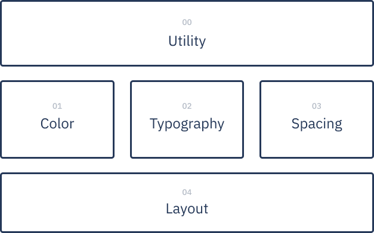

<p align="center"></p>

<h1 align="center"> Shipwright </h1>

<p align="center"> An abstraction-first CSS philosophy and framework <br> to help you implement your design system effectively. </p>

---
### Features
* **Loosely Opinionated** - Shipwright gives you a way to do things and the freedom to change it
* **Supports your Abstractions** - Our philosophy is sort of an "abstraction for abstractions"-meaning it sets up some high-level guidelines to keep your abstractions contained, yet accessible
* **Just SASS Files** - No need to worry about unseen bloat being added to your project. No need to worry about unclear build processes, either. If you've worked with SASS, you know how everything works.
* **Modular** - Shipwright strives to keep each module useful in isolation. When it needs stuff from other files, it makes that clear.

### Installation

1. Copy the files in `src` to wherever you're keeping your SASS files.
2. To see an example, install [Parcel](https://parceljs.org/) and compile `src/index.html`
```bash
parcel src/index.html
```

### Modules
<p align="center"></p>

---

## Acknowledgements
* [README Template](https://github.com/vladocar/boilerplate-readme-template/blob/master/README-Markdown.md)

Licensed under the [MIT license](https://github.com/earlman/np-design-system/blob/System-Redesign/LICENSE).

